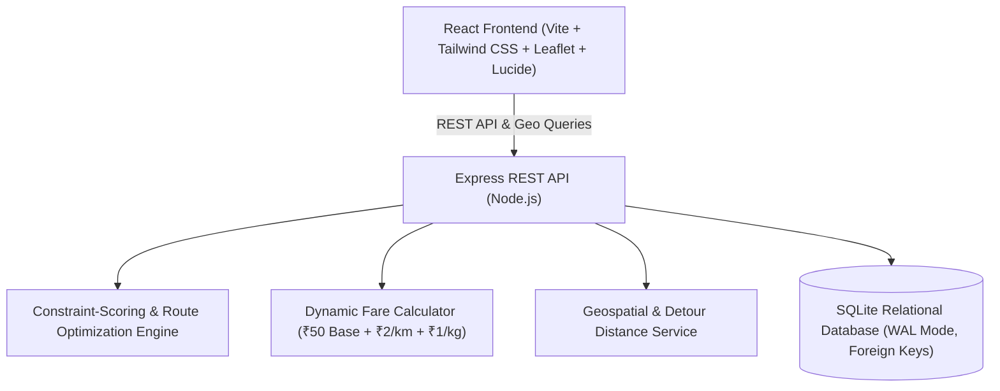
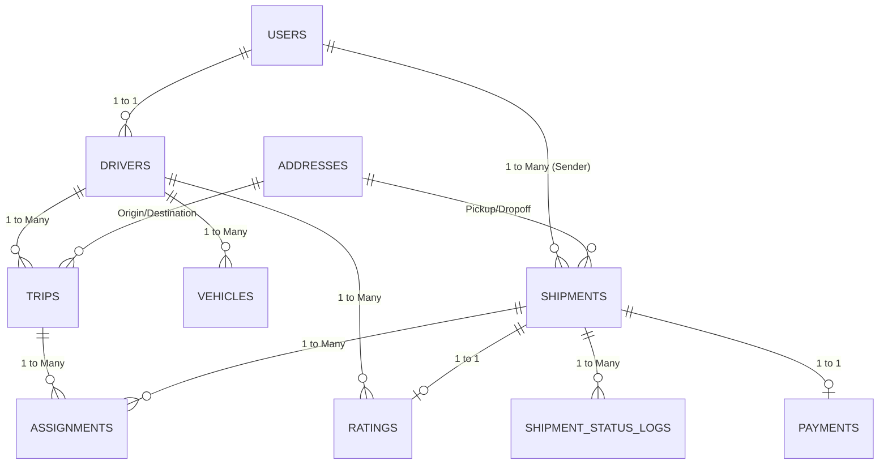

# Logistics Sharing Platform - Implementation Plan

A minimalist, high-performance web-based logistics and freight-sharing platform connecting drivers with available cargo capacity to senders looking to ship goods along matching routes.

---

## 1. System Architecture & Tech Stack



### Tech Stack
- **Frontend**: React 18, Vite, Tailwind CSS, Lucide Icons, Leaflet & React-Leaflet for interactive maps, Canvas Confetti for delivery milestones.
- **Backend**: Node.js, Express, `better-sqlite3` (ultra-fast synchronous SQLite bindings with ACID foreign key enforcement).
- **Mapping & Geocoding**: OpenStreetMap tiles with Leaflet, geocoding coordinates for Indian logistics hubs/cities, real-time route path rendering.
- **Security & Auth**: JWT authentication, hashed passwords, role-based access control (Driver, Sender, Admin).
- **Design System**: Minimalist, premium aesthetic with crisp typography, generous whitespace, charcoal/indigo accents, and responsive collapsible sidebar.

---

## 2. Database Schema Design (SQLite Relational Model)



### Table Definitions
1. **`users`**: `id`, `name`, `email`, `password_hash`, `phone`, `role` (`'driver'`, `'sender'`, `'admin'`), `id_verified` (BOOLEAN), `id_document_url`, `created_at`.
2. **`drivers`**: `id`, `user_id` (FK), `license_number`, `is_verified` (BOOLEAN), `avg_rating` (FLOAT), `total_ratings` (INT), `status` (`'active'`, `'inactive'`).
3. **`vehicles`**: `id`, `driver_id` (FK), `registration_number`, `vehicle_type` (`'Pickup Truck'`, `'Mini Van'`, `'Trailer'`, `'Flatbed'`, `'Container'`), `capacity_kg`, `current_load_kg`, `created_at`.
4. **`addresses`**: `id`, `street`, `city`, `state`, `postal_code`, `lat`, `lng`.
5. **`trips`**: `id`, `driver_id` (FK), `vehicle_id` (FK), `source_address_id` (FK), `dest_address_id` (FK), `departure_datetime`, `available_capacity_kg`, `total_capacity_kg`, `route_name`, `status` (`'scheduled'`, `'in_transit'`, `'completed'`, `'cancelled'`), `created_at`.
6. **`shipments`**: `id`, `sender_id` (FK), `pickup_address_id` (FK), `drop_address_id` (FK), `weight_kg`, `volume_m3`, `package_type` (`'Electronics'`, `'Perishables'`, `'Textiles'`, `'General Freight'`, `'Fragile'`), `scheduled_pickup`, `required_delivery`, `fare_amount`, `pickup_otp`, `delivery_otp`, `pickup_photo_url`, `delivery_photo_url`, `status` (`'pending'`, `'booked'`, `'picked_up'`, `'in_transit'`, `'delivered'`, `'cancelled'`), `current_lat`, `current_lng`, `created_at`, `updated_at`.
7. **`assignments`**: `id`, `trip_id` (FK), `shipment_id` (FK), `assigned_at`, `acceptance_status` (`'accepted'`, `'declined'`, `'completed'`).
8. **`shipment_status_logs`**: `id`, `shipment_id` (FK), `status_type` (`'Created'`, `'Booked'`, `'PickedUp'`, `'InTransit'`, `'Delivered'`), `location_name`, `notes`, `timestamp`.
9. **`payments`**: `id`, `shipment_id` (FK), `amount`, `currency` (`'INR'`), `payment_status` (`'pending_escrow'`, `'held_in_escrow'`, `'completed'`, `'refunded'`), `paid_at`, `released_at`.
10. **`ratings`**: `id`, `shipment_id` (FK), `driver_id` (FK), `sender_id` (FK), `rating_value` (1-5), `comments`, `created_at`.

---

## 3. Matching & Route Optimization Algorithm

### Mathematical Scoring Engine
For every candidate pair of **Trip \(T\)** and **Shipment \(S\)**:

1. **Hard Constraint Filtering**:
   - **Weight Capacity**: \(S_{\text{weight}} \le T_{\text{available\_capacity}}\)
   - **Time Window**: \(S_{\text{pickup\_time}} \ge T_{\text{departure\_time}} - \Delta t_{\text{early}}\) and \(S_{\text{delivery\_deadline}} \ge T_{\text{arrival\_time}}\)
   - **Detour Tolerance**: Detour distance \(\le 30\text{ km}\) deviation from primary route corridor.
   - **Special Handling**: Vehicle type compatibility with package type.

2. **Multi-Factor Scoring Function**:
   \[
   \text{MatchScore} = w_1 \cdot \text{RouteOverlap} + w_2 \cdot \text{UtilizationGain} + w_3 \cdot \text{NormalizedRevenue} - w_4 \cdot \text{DetourPenalty} - w_5 \cdot \text{DelayPenalty}
   \]
   - **Route Overlap \((0 \to 1)\)**: Dot product alignment of trajectory vectors \(\vec{v}_T\) and \(\vec{v}_S\).
   - **Utilization Gain \((0 \to 1)\)**: \(\frac{S_{\text{weight}}}{T_{\text{total\_capacity}}}\).
   - **Normalized Revenue \((0 \to 1)\)**: Estimated shipment fare relative to baseline trip costs.
   - **Detour Penalty \((0 \to 1)\)**: Additional km required to visit pickup and drop-off points.
   - **Delay Penalty \((0 \to 1)\)**: Added minutes compared to the direct trip timeline.

3. **Greedy Knapsack Shipment Bundling**:
   - Sorts compatible shipments by \(\text{MatchScore} / S_{\text{weight}}\).
   - Bundles top candidate shipments without exceeding remaining payload capacity.
   - Projects aggregate earnings and space utilization for the driver.

4. **3-Route Variant Engine (A, B, C)**:
   - **Route A (Fastest Highway Expressway)**: Direct corridor, lowest detour allowance, highest speed.
   - **Route B (Commercial Freight Corridor)**: Passes through intermediate commercial hubs/clusters, yielding higher shipment bundle density and maximum earnings.
   - **Route C (Detour-Optimized / Local Toll-Free)**: Balanced local routing picking up high-margin localized parcels.

---

## 4. UI/UX Architecture

```
+-----------------------------------------------------------------------------------+
|  [Logo] VELOCITY LOGISTICS      | Mode: [Driver] [Sender] [Tracker] | [User Menu] |
+-----------------------------------------------------------------------------------+
| [=] Collapsible Sidebar | Main Content Area                                       |
|  - Dashboard            |                                                         |
|  - Active Trips         |  [ Driver View: Create Trip Form + 3 Route Options ]    |
|  - Shipments            |  [ Interactive Leaflet Map Preview with Multi-Stop Pins]|
|  - Live Tracker         |  [ AI-Matched Shipment Knapsack Recommendations ]       |
|  - Escrow & Payments    |  [ Accept / Bundle Actions with Instant Earning Proj ]  |
|  - Ratings & Profile    |                                                         |
+-------------------------+---------------------------------------------------------+
| [Quick Tester Switcher: Driver | Sender | Admin] [Generate Demo Data] [Wipe DB]   |
+-----------------------------------------------------------------------------------+
```

### Key UI Features
1. **Collapsible Sidebar**: Quick transitions between Driver, Sender, and Tracker with responsive hamburger collapse.
2. **Minimalist, High-Contrast UI**: Dark slate sidebar, clean white cards, indigo accent colors, clear hierarchy, zero clutter.
3. **Empty Slate by Default**: Clean "No trips/shipments created yet" zero-states on initial launch.
4. **Interactive Leaflet Map**:
   - Origin & Destination markers with custom SVG icons (truck, parcel, warehouse).
   - Polyline route lines with color-coded stops.
   - Detour visualization for bundled shipments.
5. **Interactive Verification & Escrow Modal**:
   - Sender creates shipment -> Fare breakdown (Base ₹50 + ₹2/km + ₹1/kg).
   - Escrow payment holds funds securely.
   - Pickup OTP prompt + simulated photo capture upload.
   - Delivery OTP prompt + instant escrow payout release.
   - 5-Star Driver Rating dialog with instant profile badge updates.
6. **Tester Demo Toolbar**:
   - Switch active user instantly without tedious login screens.
   - "Generate Sample Logistics Corridor" (Delhi - Agra - Jaipur or Mumbai - Pune) for instant 1-click live demo.
   - "Wipe Database" for clean reset.

---

## 5. Implementation Steps & File Structure

```
SIH_26/
├── server/
│   ├── package.json
│   ├── src/
│   │   ├── db.js                 # SQLite init, schema creation, WAL mode
│   │   ├── schema.sql            # Normalized DDL tables & indexes
│   │   ├── services/
│   │   │   ├── matching.js       # Scoring algorithm, Knapsack bundler, Route A/B/C
│   │   │   ├── fare.js           # Dynamic fare calculation
│   │   │   ├── geo.js            # Haversine, detour, waypoint interpolation
│   │   │   └── sampleData.js     # Realistic demo corridor data generator
│   │   ├── routes/
│   │   │   ├── auth.js           # Signup, login, switch user
│   │   │   ├── trips.js          # Trip CRUD, route generation, match discovery
│   │   │   ├── shipments.js      # Shipment CRUD, fare quotation, OTP verifications
│   │   │   ├── tracker.js        # Live shipment timeline & GPS updates
│   │   │   ├── payments.js       # Escrow holding & release
│   │   │   ├── ratings.js        # Post-delivery reviews
│   │   │   └── admin.js          # DB reset and sample generator
│   │   └── server.js             # Express app entrypoint & API mounting
├── client/
│   ├── package.json
│   ├── vite.config.js
│   ├── tailwind.config.js
│   ├── index.html
│   └── src/
│       ├── main.jsx
│       ├── App.jsx
│       ├── index.css
│       ├── api.js                # Axios / fetch wrapper for all endpoints
│       ├── context/
│       │   └── AuthContext.jsx   # Active user state & quick role switcher
│       ├── components/
│       │   ├── Sidebar.jsx       # Collapsible navigation
│       │   ├── TopNav.jsx        # User status, notifications, active role indicator
│       │   ├── TesterToolbar.jsx # Quick demo user switcher & DB seeder/wiper
│       │   ├── MapView.jsx       # Leaflet interactive map with route polylines
│       │   └── EmptyState.jsx    # Minimalist zero-state placeholder
│       ├── pages/
│       │   ├── DriverDashboard.jsx  # Trip creation, A/B/C routes, match acceptance
│       │   ├── SenderDashboard.jsx  # Shipment creation, fare estimate, truck discovery
│       │   ├── TrackerPage.jsx      # Live tracking, OTP pickup/delivery modals
│       │   ├── PaymentsPage.jsx     # Escrow status & earnings ledger
│       │   └── ProfilePage.jsx      # Driver ratings, vehicle info, ID verification
```

---

## 6. Verification & End-to-End Testing Plan

### Automated & Manual Verification Steps
1. **Empty Slate Check**: Launch app on clean database -> Verify all tables exist with 0 rows and UI displays clean empty-state cards.
2. **Driver Workflow**:
   - Register/Select Driver.
   - Register Vehicle (Capacity: 1500 kg).
   - Create Trip: New Delhi to Jaipur (Departure: Tomorrow 08:00 AM).
   - Inspect the 3 Route Variants (Route A: Expressway, Route B: Freight Corridor, Route C: Direct).
3. **Sender Workflow**:
   - Register/Select Sender.
   - Create Shipment: Gurgaon to Jaipur (Weight: 350 kg, Electronics).
   - Verify Fare Breakdown: Base ₹50 + ₹2/km + ₹1/kg.
   - Discover matched New Delhi -> Jaipur trip with high Match Score.
   - Reserve slot -> Escrow payment held in "Pending".
4. **Matching & Bundling Validation**:
   - Verify Driver Dashboard updates with real-time match alert and capacity utilization increase.
   - Driver accepts shipment into Trip bundle.
5. **OTP Pickup & Delivery Lifecycle**:
   - Sender receives 6-digit Pickup OTP.
   - Driver inputs Pickup OTP -> Status transitions to `"In Transit"`.
   - Driver simulates location progress to destination.
   - Sender inputs Delivery OTP -> Status transitions to `"Delivered"`.
   - Escrow payment automatically transitions to `"Completed / Released"`.
6. **Rating & Feedback Validation**:
   - Sender rates Driver 5 stars with comment "Prompt pickup and careful handling!".
   - Verify Driver profile updates average rating score and review list.
7. **Demo Lab Tool Verification**:
   - Test "Generate Sample Logistics Corridor" to populate realistic multi-shipment scenario.
   - Test "Wipe Database" to return to pristine empty state.
